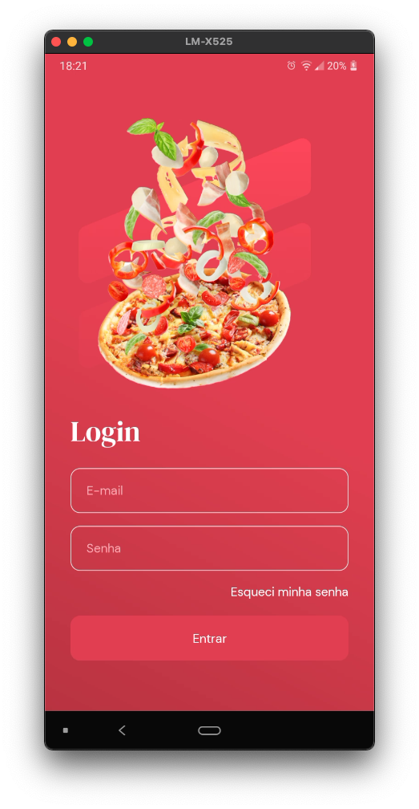
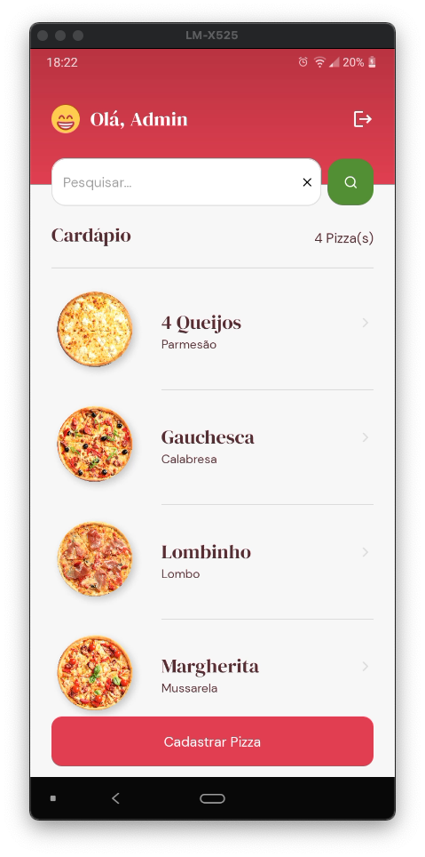
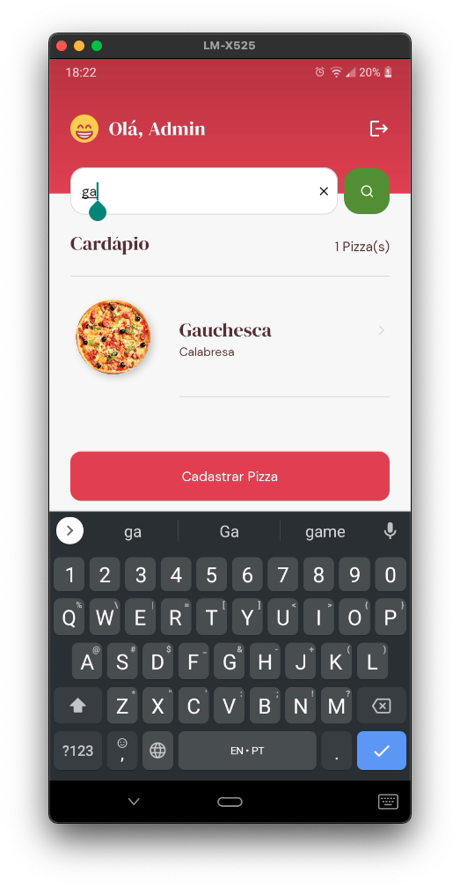
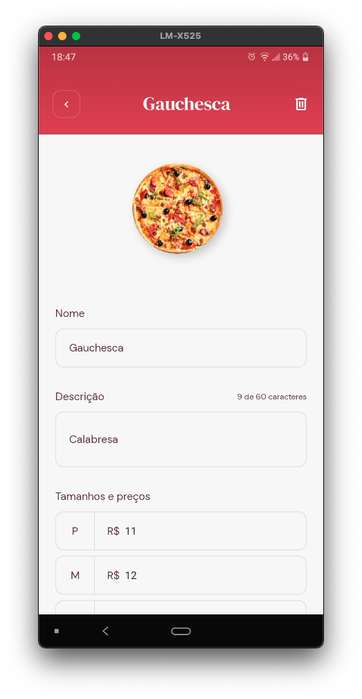
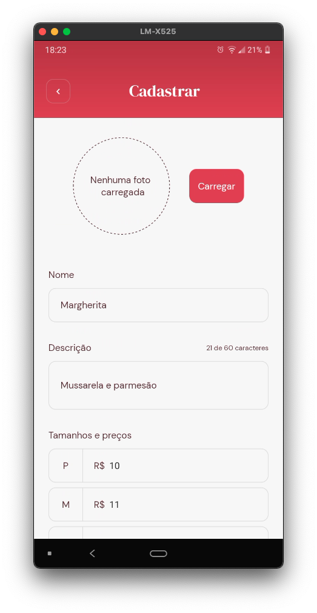
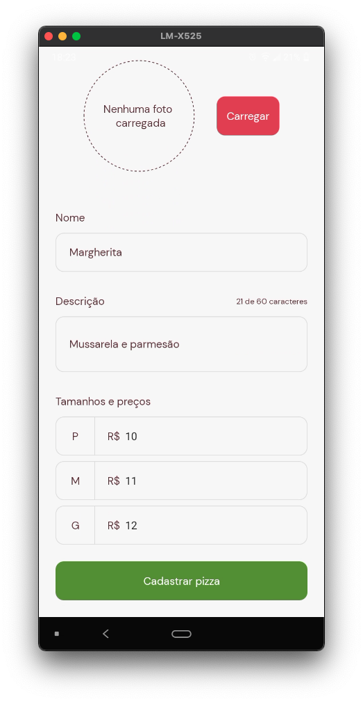
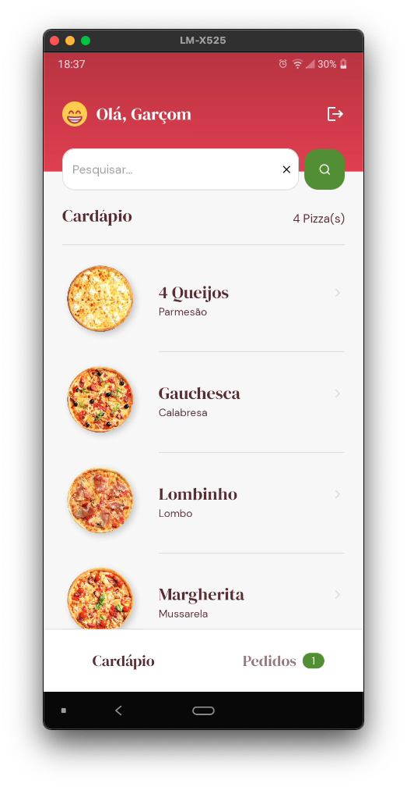
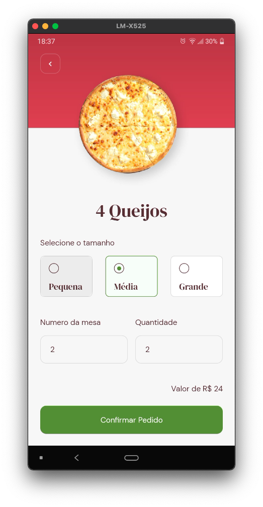
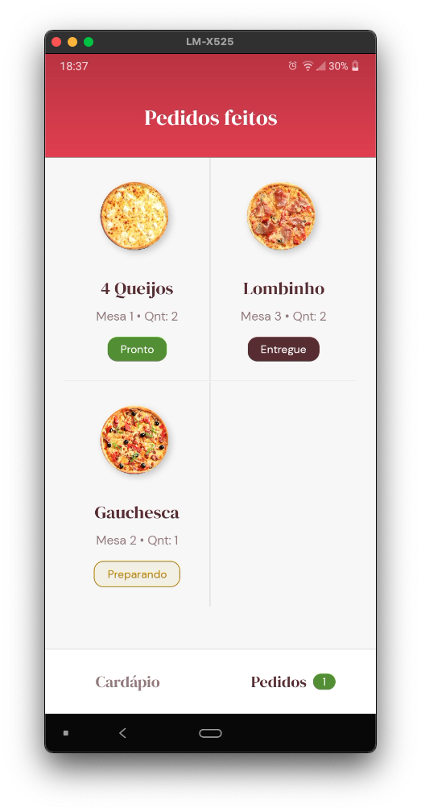
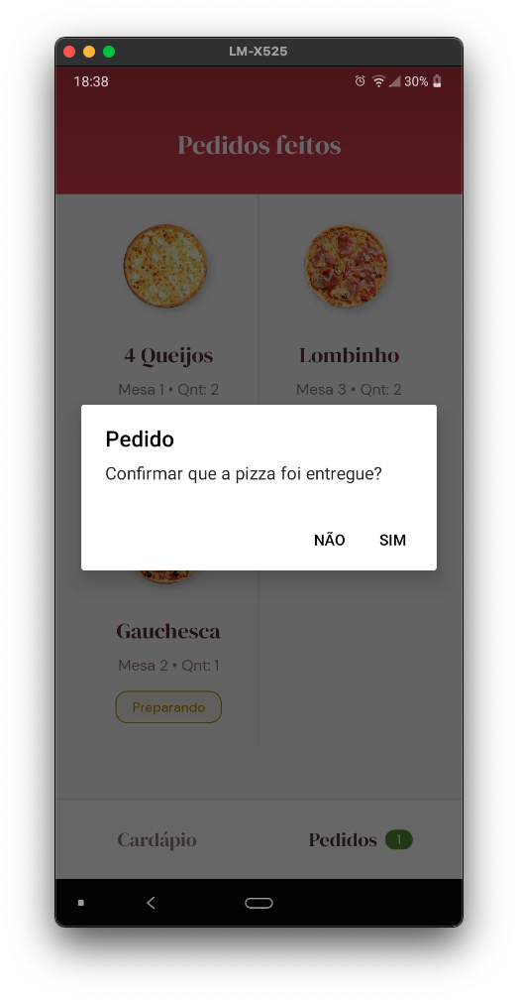

# Go Pizza

O Go Pizza é uma aplicação desenvolvida como resultado de estudos da trilha Ignite da Rocket Seat. O objtivo do App é auxiliar Garçons de uma Pizzaria. Nesse App o Administrador cadastra o cardápio de pizzasm, o Garçom registra o pedido do cliente e acompanha o processo de preparação da Pizza. Essa aplicação utiliza o banco de dados Realtime do Firestore, Autenticação e Storage do Firebase para armazenar imagens. o App foi desenvolvido em Expo com Bare Workflow, React Native, Typescript, Javascript, Styled Components e mais.

https://www.rocketseat.com.br/ignite

## Features

• Login  
• Recover Password by e-mail  
• Home (based on the logged in user's profile)  
• Search  
• Register Pizza  
• Register Order  
• View Ordes  
• Deliver Order  

## Admin view screens

  
  
  
  
  

## Waiter view screens

  
  
  

## App

